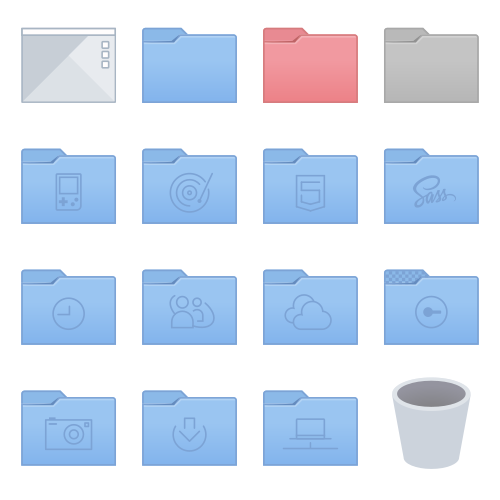

# Pixel Perfect Folder Icons for KDE Plasma

You love your icon theme but the folders don't quite live up to it?
NixOS folders to the rescue!

This set includes *more than 80* different **finely crafted** folder icons including 32px versions like: remote-backup, disk-vinyl, dev-sass, gdrive and many more!  
The default folder, including colored versions and the kde system-file-manager app, even have pixel perfect resolutions for 22 and 16 pixels.
Each icon is meticulously drawn to their resolution for that perfect sharp look.

### Installing

Go to `System Settings > Icons > Get New Themes...` and search for `NixOS`.  
By default the theme inherits breeze icons first then Adwaita if breeze is not found or lastly hicolor.

### How to mix with your favorite themes

You could either make a new theme folder and mix together the coolest icons you downloaded so far - that's what I usually do; detailed instructions can be found [here](https://askubuntu.com/a/42571/610719); adjust paths for other DEs - or set the icons to NixOS and change one simple line in the `index.theme` file (most probably found at `~/.local/share/icons/nixos-folders/`). It's line 48 and says `Inherits=breeze,gnome,hicolor`. You have to specify the name of the theme you want to combine as it appears on its folder (which could be as long as "la-capitaine-icon-theme-0.x.0" or "ketsa-icon-theme"). This way you can even combine various icon themes. Just put those which have few but very nice icons to inherit first and then put some follow-ups after those. (Don't forget to log-out and back in after applying any changes to your icon themes)  
You could even go completely nerd and add a function to the theme to recursively use specific folders from specific themes, [which is explained in the spec](https://specifications.freedesktop.org/icon-theme-spec/icon-theme-spec-latest.html#icon_lookup).

### Important:
I don't know for Gnome, but getting icons to show up after changes in KDE can be a pain in the ***. Log out of your session, log into tty2 or another DE and remove `/var/tmp/kdecache-$USER/icon-cache.kcache` where `$USER` is the name of the user having the icon issues.

### License

This project is licensed under the CC-BY-NC-SA - see the [LICENSE](LICENSE) file for details

### Coffee
In the past years I have spent quite some hours on open source projects. If you are the type of person who digs attention to detail, know how much work is involved in it and/or simply likes to support makers with a coffee or a beer I would greatly appreciate your donation on my [PayPayl](https://www.paypal.me/marianarlt) account.
